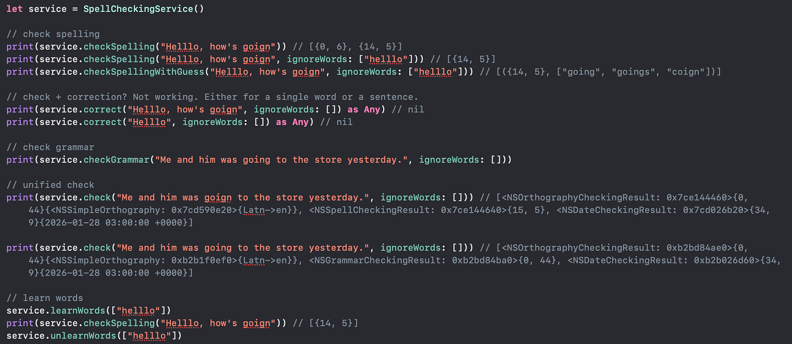

# Swift_OnDeviceSpellGrammarCheck
A demo of using NSSpellChecker for on device spell and grammar checks.

For more details, please refer to my blog [Swift: On Device Spell/Grammar Check & Correction(?)]()

